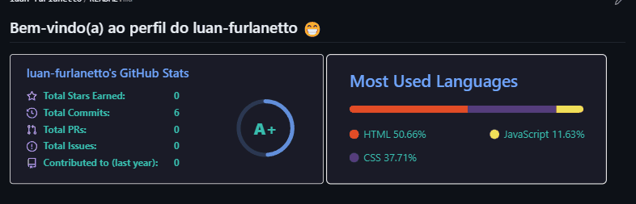

# Projeto com README
Um projeto de teste com um arquivo README 😍


[](https://github.com/luan-furlanetto)

## Tecnologias utilizadas
- HTML
- CSS
- JS

## Como utilizar

1-Clone pro o projeto
```
git clone
```
2-Acesse a pagina do projeto
```
cd repositorio-com-readme
```